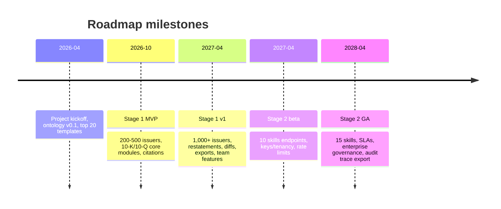

# Whitepaper Research Report on a Machine-Readable Accounting Interpretation Service

## Executive summary

Public-company disclosures (10-K/10-Q, earnings releases, MD&A, notes, and earnings-call transcripts) contain the highest-signal inputs for fundamental analysis, but they are expensive to digest because the “meaning” is embedded in accounting policy choices, footnote nuances, non‑GAAP adjustments, and management language. Even when numbers are available as structured data (e.g., Inline XBRL and SEC-extracted XBRL JSON), the professional interpretation layer remains largely unstandardized, heterogeneous across firms, and difficult to consume programmatically. citeturn21search1turn3search5turn20search2

This startup concept is feasible and strategically well-positioned if it is built as a **professional-grade interpretation layer** rather than a “signal/alpha engine.” Two-stage execution is especially coherent:

- **Stage 1 (output-only):** precomputed, standardized, machine-readable accounting interpretations for selected coverage (e.g., initial universe like S&P 500 / large-cap), grounded in a rigorous ontology and authored judgment templates (Stern Accounting PhD).  
- **Stage 2 (agent-facing black-box):** “skills API” that exposes high-level callable capabilities (e.g., earnings quality assessment, policy change detection) without exposing internal pipelines, intermediate artifacts, or prompt chains—optimized for agentic workflows and tool calling.

The “why now” is strong: the SEC provides developer-accessible APIs and bulk archives for filings history and extracted XBRL data (supporting scalable ingestion), while major incumbents are explicitly moving toward AI/agent integrations around licensed financial data in mainstream workflows. citeturn3search5turn20search2turn14search3turn14search23

A further architectural signal arrived in late 2026: OpenAI launched **GPT-Rosalind**, a domain-specific frontier reasoning model for life sciences, paired with a **Life Sciences Research Plugin for Codex** that exposes 50+ public databases and biology tools as a modular skill library — explicitly described as an “orchestration layer” over the model. This is the same shape proposed here (domain reasoning capability + orchestration skill layer), applied to a different vertical, and it confirms that frontier labs view “domain model + modular skills + orchestration” as a deployable production pattern rather than a research curiosity. The implication for this project: the *architecture* is now industry-validated; the differentiator is no longer the shape but the depth of expert judgment encoded in the skills and the integrity of citation-grounded outputs. [ref: OpenAI, “Introducing GPT-Rosalind for life sciences research,” 2026]

## Product thesis and value propositions

### Core thesis

You are building a missing infrastructure layer: **standardized accounting interpretations as machine-readable primitives**. In practice, this means a user (human or AI agent) can query “revenue quality,” “non-recurring items,” “working capital drivers,” or “policy changes” as structured objects with explicit provenance, rather than reading long documents or relying on generic summaries.

This thesis aligns with well-established evidence that the *text* and disclosure shaping in filings carry systematic information content (e.g., tone dictionaries in 10-Ks; readability and obfuscation links to performance/earnings management), validating the need for rigorous, auditable textual interpretation rather than shallow summarization. citeturn2search1turn3search7turn3search19

### Value propositions

**Standardization and comparability**
- Produce the same schema for every company, period, and filing type, enabling comparisons at scale (cross-company, within-company over time, peer sets). (Design implication: strict ontology + versioned schemas.)

**Professional-grade judgment**
- Encode accounting expertise as **judgment templates** (e.g., how to interpret changes in revenue recognition, reserves, impairment, restructuring, SBC, tax valuation allowances), authored and governed by an accounting expert rather than “LLM vibes.” This is the credibility engine (and a product differentiator versus search-first platforms).

**Traceability as trust**
- Every output claim is backed by citations to the underlying disclosure location (section, note, exhibit, transcript passage). This is essential given known data-quality limitations in structured filings (XBRL errors and tag extensions) and known risks in generative outputs. citeturn2search7turn2search26turn21search7

**Speed and workflow integration**
- Stage 1 outputs are precomputed—time-to-answer is seconds, not hours of parsing and reading. SEC data accessibility and bulk archives support feasible large-scale refresh cycles. citeturn20search2turn20search18

**Agent readiness**
- Stage 2 exposes *capabilities* as “black-box skills,” consistent with the market direction: major providers highlight agents and AI-driven workflows alongside licensed financial data. citeturn14search23turn15search19turn14search11

### Product philosophy: professional-grade interpretation at the core

The product is not primarily about aggregating data and news — aggregation is  only the starting point. The real value we deliver is **professional-grade financial statement analysis**: the kind of judgment a senior accounting or finance specialist would bring to a filing, turned into a structured, consumable output. Three reinforcing pillars define the core pitch:

- **Professional depth.** We analyze statements and financial data through a rigorous accounting, corporate finance, and capital markets lens, producing insights on par with an experienced external specialist rather than a surface-level summary. Every interpretation is grounded in standards-based reasoning and practitioner experience, not "LLM vibes."
- **Deep interpretation, not just aggregation.** The platform is more than a venue for collecting professional information — it performs the interpretation itself, turning "numbers you can see" into "meaning you can act on." Users no longer have to stitch together scattered disclosures to understand what a data point actually implies about the business.
- **Lowering the barrier.** We deliver this professional output in plain, approachable language, so that complex financial and accounting information becomes accessible to a much broader audience. Rigor and readability are not a trade-off in our product; they are a deliberate, combined goal.

Put together — **professional depth + deep interpretation + lower barriers** — this combination lets far more people understand financial and accounting information faster and more easily, and turns what has historically been a closed, specialist-gated service (financial and accounting advisory) into something that can be meaningfully democratized. In other words, we are not merely moving data around; we are packaging **expert judgment itself as a scalable product capability**.

## Target users, competitive landscape, and market size

### Target personas

**Buy-side analyst / PM (hedge fund, mutual fund, long-only)**
- Pain: earnings season overload; lack of consistent footnote-level insights; need faster diligence.  
- Core jobs: “What changed?”, “What’s driving cash vs earnings?”, “Where is the accounting risk?”

**Private equity / credit investor**
- Pain: footnotes, debt covenant language, working capital, non-recurring adjustments—often where deals are won/lost.  
- Core jobs: diligence standardization; red-flag scanning; comparability across targets.

**Sell-side / investment banking**
- Pain: fast preparation for comps, CIMs, credit memos; deep document search is necessary but not sufficient.  
- Core jobs: pull defensible accounting interpretations for narratives and models.

**Corporate finance / IR / strategy**
- Pain: competitor benchmarking; preparing for analyst questions; consistent story across filings and calls.  
- Core jobs: “how do peers disclose / adjust / explain?”

**Agent builders (AI-native investing tools, copilots, research automation)**
- Pain: agents need deterministic, structured outputs with citations; raw filings are too large/noisy.  
- Core jobs: tool calling, structured retrieval, and compliance-ready audit trails.

### Competitive landscape

The market is crowded in **data + search**, but much thinner in **professional, standardized interpretation with auditable provenance**.

| Provider | What they’re strong at | Evidence | Gaps vs your Stage 1/2 thesis | Likely moat | Likely weakness |
|---|---|---|---|---|---|
| entity["company","S&P Global","market intelligence provider"] (Capital IQ / Market Intelligence) | Deep datasets + platforms; broad company coverage; document intelligence and AI tools | Capital IQ Pro describes access to **109,000+ public companies** and highlights AI-powered document intelligence. citeturn19view0turn20search4 Market Intelligence segment revenue **$4.916B (2025)** indicates scale. citeturn11view0 | Interpretation not standardized as an “accounting judgments API”; outputs often remain workflow/search centric vs “interpretation primitives.” | Proprietary datasets + enterprise distribution | Heavy enterprise sales cycles; outputs may be less opinionated/standardized at footnote judgement level |
| entity["company","London Stock Exchange Group","financial markets data company"] (Workspace / Data & Analytics) | Licensed data + workflows; strong transcript coverage | Data & Analytics revenue **£4,338m (2025)**. citeturn12view0 Transcript database: ~**40,000** transcripts per year from **10,400** companies. citeturn21search0 10‑year partnership with Microsoft emphasizes data + AI workflows. citeturn14search3 | Still primarily a platform; interpretation layer is not a standardized, accounting-professional schema product exposed as skills. | Proprietary licensed data + workflow lock-in | AI/agent layer depends on data licensing and governance complexity; not specialized to accounting judgments |
| entity["company","FactSet","financial data and analytics company"] | Fundamental datafeeds; transcripts/events; strong institutional distribution | FY2025 GAAP revenues **$2,321.7m**. citeturn5search0 Transcripts coverage described (events since 2000; transcripts since 2003). citeturn20search1 Fundamentals and datafeed positioning are explicit. citeturn0search8 | Interpretation layer is not the primary product; heavy focus on data delivery + analytics. | Data breadth + client entrenchment | Less “explainable accounting judgment” differentiation; outputs may remain generic or tool-centric |
| entity["company","AlphaSense","market intelligence platform company"] | AI search across huge premium content universe; transcripts, filings, research; packaging content for workflows | Official materials emphasize “domain specific AI” plus **500M+ documents**. citeturn15search19 Financial research page cites access to SEC filings, earnings transcripts, and an expert-call library with **240,000+ call transcripts**. citeturn15search5 | Core strength is “find + summarize,” not “accounting interpretation ontology.” Risks of surface-level summaries unless deeply grounded. | Content aggregation + AI search UX | Harder to deliver standardized accounting judgments with provenance across all issuers |
| entity["company","BamSEC","SEC filing research tool"] | Fast filings/transcripts workflow for individuals and teams | Pricing is transparent: **$69/month billed annually** (Pro). citeturn4view0 Positioning: SEC filings + transcripts search and table tools. citeturn4view1 | Not a structured accounting interpretation engine; more a productivity/search tool. | UX simplicity + price point | Feature depth in standardized interpretation is limited |
| “Build it yourself” (funds, research teams) | Can tailor to internal frameworks | SEC provides APIs + bulk downloads for extracted XBRL and submissions. citeturn3search5turn20search2 | High engineering + accounting overhead; hard to maintain; inconsistent outputs | Internal knowledge | Costly; hard to operationalize at scale; brittle maintenance |

**Strategic takeaway:** incumbents are converging on “AI for research workflows,” but your wedge is narrower and defensible: **auditable accounting judgments as a standardized data product**.

**A second strategic signal: domain-specific frontier models from foundation labs.** OpenAI's GPT-Rosalind launch (life sciences) demonstrates that frontier labs now ship vertical-specialized reasoning models alongside companion plugins covering 50+ external tools and databases. A future “GPT-Accountant” or equivalent from any frontier lab is a credible 18-to-36-month threat. Pre-emptive defensibility comes from two places that a foundation-lab plugin will struggle to replicate: (a) **expert-authored judgment templates with versioned ontology**, governed by a domain practitioner rather than auto-extracted from public material; and (b) **citation-grounded provenance with restatement-aware versioning**, which is an audit and compliance contract, not just a feature. The wedge is not “we built an orchestration layer” — that becomes commodity. The wedge is “every output is defensible to a CFO, an auditor, and a regulator.” [ref: OpenAI, “Introducing GPT-Rosalind for life sciences research,” 2026]

### Market size estimation

Because this product sits between “data terminals” and “research labor,” market sizing is best done with explicit assumptions and multiple lenses (top-down proxy + bottom-up seats).

#### Reference anchors from official financials

- S&P Global Market Intelligence segment revenue: **$4.916B (2025)**. citeturn11view0  
- LSEG Data & Analytics revenue: **£4,338m (2025)**. citeturn12view0  
- FactSet FY2025 revenues: **$2.3217B**. citeturn5search0  

These three alone imply >$7B + £4.3B of annual spend in adjacent “data/analytics/workflow” segments, before counting other major providers and without isolating your narrower interpretation category.

#### Bottom-up seat and workflow demand signals

- US employment: financial & investment analysts **~368,500 (2024)**. citeturn17view0  
- US employment: accountants & auditors **~1,579,800 (2024)**. citeturn17view1  
- Global professional benchmark: “over 200,000” CFA charterholders worldwide. citeturn22view0  
- Global accountancy footprint: IFAC represents “millions” of professional accountants worldwide (membership as of Jan 2026). citeturn16search0  

These figures do **not** mean all are buyers. They do show that the addressable universe of professionals who routinely parse financial statements is large, even before including corporate strategy/IR roles and automated agent workloads.

#### TAM / SAM / SOM model (explicit assumptions)

**Assumptions (illustrative, adjustable):**
- Target buyer willingness-to-pay (blended) for “professional disclosure interpretation” ranges from prosumer pricing (e.g., ~$69/month benchmarked by BamSEC) to enterprise seat pricing (often materially higher). citeturn4view0  
- Product positioning is closer to “professional research infrastructure” than “consumer finance,” so early monetization should focus on professional and team tiers.

**TAM (Total Addressable Market)**  
Definition: global spend for tools supporting public-company financial disclosure research workflows (filings + transcripts + interpretation), including seats and API usage.

- **Proxy approach:** TAM likely sits in the **tens of billions USD** annually, because single segments of major incumbents already generate multi‑billion revenue (S&P MI; LSEG D&A; FactSet revenues). citeturn11view0turn12view0turn5search0  
- **Working range assumption:** **$20B–$50B** TAM (interpretation-adjacent market intelligence/workflow spend), acknowledging this includes broader datasets than your initial narrow offering.

**SAM (Serviceable Addressable Market)**  
Definition: spend specifically addressable by your product characteristics—**public-company filings + earnings + transcripts interpretation**, with strict traceability and standardized schema.

- Assumption: SAM is **10%–20% of TAM** because many terminal/workflow budgets are spent on asset-class data, trading, indices, or non-disclosure datasets (outside your scope).  
- Implied SAM: **$2B–$10B**.

**SOM (Serviceable Obtainable Market)**  
Definition: revenue a new entrant could realistically capture in 3–5 years.

- Assumption: early SOM depends on (a) a narrow coverage wedge (e.g., large-cap US), (b) high retention due to workflow integration, and (c) enterprise pilots.  
- Example 3-year SOM: **$5M–$25M ARR** (consistent with a focused “premium infrastructure” startup, not a terminal replacement).

## Product specification and API skill design

### Stage 1 product features

Prioritize features that maximize **trust + utility + comparability**, not novelty.

**Foundational (must-have)**
- **Standardized ontology + versioned schema:** published contract for what “revenue quality,” “non-recurring,” “policy change,” etc. mean in your system.
- **Traceability:** every field should store references to source passage(s) from filings/transcripts.
- **Restatement-aware versioning:** when amended filings appear, outputs re-run and preserve old versions.
- **Cross-document linking:** connect earnings release ↔ 10-Q ↔ transcript where the same issues are discussed.

**Differentiators (high leverage)**
- **Accounting judgment templates** authored by the Stern Accounting PhD (governed, reviewed, versioned).  
- **Consistency checks** across statements (ties, rollforwards, cash vs accrual reconciliation) to reduce both XBRL and extraction errors. Evidence that XBRL quality issues exist and can cluster in notes/smaller filers makes these checks important. citeturn2search7turn2search26turn21search7
- **Disclosure-change diffing:** what changed vs last quarter/year (risk factors, key policies, segment reporting, non‑GAAP).

**Outputs**
- JSON (primary), plus optional exports (Parquet/SQL views) for quant workflows.

### Stage 2 black-box skills API design principles

- **Expose intent-level capabilities, not pipeline units.** (No “parse_section_v3,” no prompt chains.)  
- **Return structured outputs + citations + confidence.**  
- **No intermediate artifacts** (token-level reasoning traces, chain-of-thought, or raw extraction dumps) to reduce IP leakage risk.  
- **Rate limits + metering** to limit reverse engineering via query spam.

This aligns with broader market movement toward agent integrations around licensed data and tools. citeturn14search23turn15search19

### Core skills list with schemas and examples

Below is a practical 10–15 skill set that is (a) valuable in Stage 2, and (b) still consistent with Stage 1 output-only thinking because each skill can be backed by precomputed artifacts.

**Skill return conventions (recommended baseline schema)**
- `result_version`: semantic version of schema  
- `as_of`: processing timestamp  
- `inputs`: normalized params  
- `outputs`: structured results  
- `citations`: list of `(doc_id, section, locator, excerpt_hash)`  
- `confidence`: numeric + brief reasons  
- `warnings`: data quality / ambiguity flags  

#### Skills

1) **`analyze_filing_bundle`**  
Input: `{cik|ticker, period_end, filing_types:[10K,10Q,8K], include_transcript:boolean}`  
Output: canonical “interpretation bundle” keyed by ontology domains.

2) **`standardize_financial_statements`**  
Purpose: map reported statements to a normalized model (IS/BS/CF), align periods, detect restatements.

3) **`detect_accounting_policy_changes`**  
Purpose: identify policy/disclosure changes vs prior filing; tag impacted line items and notes.

4) **`revenue_quality_assessment`**  
Purpose: growth drivers, recognition risk, contract assets/liabilities movements, concentration, returns/allowances.

5) **`earnings_quality_and_accruals`**  
Purpose: accrual signals, reserves movement, non-cash components, one-time items.

6) **`non_recurring_and_adjustments_map`**  
Purpose: reconcile GAAP ↔ non-GAAP; classify adjustments (restructuring, impairment, litigation, SBC).

7) **`cash_flow_quality`**  
Purpose: CF vs NI reconciliation drivers, recurring FCF definition mapping, sustainability flags.

8) **`working_capital_drivers`**  
Purpose: AR/AP/inventory changes, cash conversion cycle drivers, seasonal vs structural changes.

9) **`liquidity_debt_and_covenants_scan`**  
Purpose: maturities, liquidity sources, covenant language extraction and risk flags.

10) **`segment_and_geography_analysis`**  
Purpose: segment contribution changes, margin drivers by segment, disclosure changes.

11) **`risk_factor_change_detection`**  
Purpose: diff risk factors, categorize new/removed risks, map to themes.

12) **`mdna_outlook_and_guidance_extraction`**  
Purpose: structured extraction of outlook commentary, uncertainties, capex plans, known trends.

13) **`transcript_qna_accounting_topics`**  
Purpose: extract accounting-relevant Q&A themes (pricing, inventory, reserves, impairments, revenue timing).

14) **`peer_compare`**  
Purpose: compare standardized outputs across `peer_set`, return a normalized comparison object.

15) **`audit_trace_export`**  
Purpose: export only citations/provenance + output hashes for compliance and reproducibility.

### Example structured output JSON for a sample company report

```json
{
  "result_version": "1.0.0",
  "company": {
    "ticker": "SAMPLE",
    "cik": "0000000000",
    "fiscal_period_end": "2025-12-31",
    "filing_bundle": ["10-K", "Earnings Call Transcript"]
  },
  "headline_findings": [
    {
      "topic": "revenue_quality",
      "assessment": "mixed",
      "summary": "Revenue growth was driven primarily by price, while volume softened; disclosures indicate increased returns/reserves in one product line.",
      "confidence": 0.78,
      "citations": [
        {
          "doc_id": "10K_2025",
          "section": "Item 7 MD&A",
          "locator": "p. 32, paragraph 4",
          "excerpt_hash": "sha256:abcd..."
        }
      ]
    }
  ],
  "modules": {
    "financials_standardized": {
      "income_statement": {
        "currency": "USD",
        "periods": ["2025", "2024", "2023"],
        "line_items": [
          {
            "name": "revenue",
            "values": [null, null, null],
            "source_mapping": {
              "xbrl_concept": "us-gaap:Revenues",
              "statement_role": "income_statement"
            },
            "citations": [
              {
                "doc_id": "10K_2025",
                "section": "Consolidated Statements",
                "locator": "p. 55, row Revenue",
                "excerpt_hash": "sha256:ef01..."
              }
            ]
          }
        ]
      },
      "data_quality_flags": [
        {
          "type": "xbrl_extension_usage",
          "severity": "medium",
          "note": "Custom tags used for certain segment metrics; requires mapping validation."
        }
      ]
    },
    "earnings_quality": {
      "overall_rating": "watch",
      "drivers": [
        {
          "name": "one_time_items",
          "impact_direction": "improved",
          "description": "Reported earnings benefited from a one-time gain; management adjusted it out in non-GAAP metrics.",
          "confidence": 0.74,
          "citations": [
            {
              "doc_id": "10K_2025",
              "section": "Note X",
              "locator": "p. 78",
              "excerpt_hash": "sha256:1122..."
            }
          ]
        }
      ],
      "recommended_followups": [
        "Validate classification of restructuring costs vs ongoing OPEX.",
        "Check reserve rollforward disclosure for changes in estimation methodology."
      ]
    }
  },
  "provenance": {
    "build_id": "build_2026-04-10_001",
    "ontology_version": "0.9.3",
    "template_set": "stern_phd_v0.4",
    "processing_time_seconds": 42
  }
}
```

### Sample API call and response

```json
{
  "endpoint": "/v1/skills/revenue_quality_assessment",
  "method": "POST",
  "headers": {
    "Authorization": "Bearer <api_key>",
    "X-Tenant-Id": "fund_alpha_01"
  },
  "body": {
    "ticker": "SAMPLE",
    "period_end": "2025-12-31",
    "sources": {
      "use_latest_10k_10q": true,
      "include_transcript": true
    },
    "output_format": "json"
  }
}
```

```json
{
  "result_version": "1.0.0",
  "as_of": "2026-04-13T14:00:00Z",
  "inputs": {
    "ticker": "SAMPLE",
    "period_end": "2025-12-31",
    "include_transcript": true
  },
  "outputs": {
    "revenue_quality": {
      "growth_components": {
        "price": "positive",
        "volume": "negative",
        "mix": "unclear"
      },
      "recognition_risk": "medium",
      "flags": [
        {
          "code": "contract_assets_increase",
          "severity": "medium",
          "explanation": "Contract assets increased faster than revenue; verify timing and collectability assumptions."
        }
      ]
    }
  },
  "citations": [
    {
      "doc_id": "10K_2025",
      "section": "Item 7 MD&A",
      "locator": "p. 33",
      "excerpt_hash": "sha256:aa55..."
    },
    {
      "doc_id": "TRANSCRIPT_Q4_2025",
      "section": "Q&A",
      "locator": "timestamp 00:42:18",
      "excerpt_hash": "sha256:bb66..."
    }
  ],
  "confidence": {
    "score": 0.77,
    "rationale": [
      "Clear disclosure of price/volume in MD&A",
      "Transcript confirms pricing actions",
      "Some ambiguity in product-level return reserves"
    ]
  },
  "warnings": [
    {
      "type": "insufficient_granularity",
      "note": "Mix effects not explicitly quantified; inferred from narrative."
    }
  ]
}
```

## Technical architecture and methodology

### Layered architecture

The system decomposes into **six layers plus four cross-cutting concerns**. The three-layer view (“data → interpretation → skills”) is retained for external positioning; the layered decomposition below is the internal engineering and governance model.

```
                        ┌─ Evaluation & gold-standard       (cross-cutting)
                        ├─ Versioning & provenance          (cross-cutting)
                        ├─ Governance / IP / legal          (cross-cutting)
                        └─ Observability & metering         (cross-cutting)

  L5  Delivery surface     Stage 1 UI  |  Stage 2 API (auth, tenancy, billing)
  L4  Skills library       Callable endpoints — agent-facing, versioned, metered
  L3  Interpretation       (a) Rule set / ontology   (declarative, expert-authored)
                           (b) Interpretation engine  (hybrid rules + constrained LLM)
  L2  Standardization      Taxonomy mapping, canonical statements, restatement detect
  L1  Document & fact store  Immutable, hash-addressed; the audit foundation
  L0  Sources & ingestion  SEC EDGAR, transcripts, iXBRL; scheduler + event bus
```

**Why this decomposition matters:**

- **L1 / L2 separation.** The fact store is what was filed (immutable). Standardization is how we map it into a canonical schema (evolves with the taxonomy). Conflating them corrupts the audit trail every time the taxonomy changes.
- **L3(a) / L3(b) separation.** The rule set is *knowledge*, authored and iterated by accounting experts at expert velocity. The engine is *code*, released by engineers at engineering velocity. Coupling them forces every template change through an engineering cycle — the single most common structural error in expert-in-the-loop products.
- **L3 / L4 separation.** Skills are orchestrations over L3 outputs with their own API surface (rate limits, billing, semver). They must be independently versioned because Stage 2 economics depend on metering and SLA per-skill, not per-interpretation.
- **L0–L2 are infrastructure, not product.** They are not separately monetized; they exist to make L3 and L4 trustworthy.

**Sellable layers:** L3 (interpretation-as-a-service) is the wedge. L4 (agent-callable skills library) is the moat once L3 is mature. L0–L2 are owned but not priced — the buyer pays for expert judgment and for agent-addressable capability, not for data they can get cheaper elsewhere.

### Data ingestion and refresh strategy

**Primary public-source ingestion**
- The SEC offers developer resources and APIs on `data.sec.gov` for submissions (filing history) and extracted XBRL, and highlights bulk archive ZIPs (e.g., `companyfacts.zip`, `submission.zip`) as the most efficient way to fetch large amounts of API data. citeturn3search5turn20search2  
- SEC full-text search supports searching electronically filed documents since 2001 (useful for validation and cross-document discovery). citeturn21search2turn21search6

**Fair access and operational constraints**
- SEC fair access policy indicates a **max request rate of 10 requests/second** and expects efficient scripting. citeturn2search0turn2search4  
- SEC requests that automated users declare their User-Agent (including app/company and contact email). citeturn13search0turn13search4  

### Hybrid extraction approach

**Deterministic extraction for structured numbers**
- Inline XBRL enables a single document that is both human- and machine-readable. citeturn21search1  
- EDGAR uses taxonomies to validate XBRL/Inline XBRL submissions. citeturn0search7turn21search13  
- Use the GAAP Financial Reporting Taxonomy as the baseline for concept mapping; FASB states the taxonomy can be used royalty-free for reporting under US GAAP. citeturn20search3turn20search7  

**LLM-assisted extraction for narrative disclosures**
- Apply constrained extraction for MD&A, notes, and transcripts: template-driven prompts + schema validation + citation requirement.
- Incorporate established finance text-analysis research as guardrails, e.g., tone dictionaries and readability metrics, to support structured signals and detect obfuscation risks. citeturn2search1turn3search7turn3search19  

image_group{"layout":"carousel","aspect_ratio":"16:9","query":["SEC EDGAR 10-K filing example","Inline XBRL example in SEC filing","10-Q MD&A section example","earnings call transcript excerpt example"],"num_per_query":1}

### Ontology, traceability, and reproducibility

**Ontology**
- Versioned taxonomy for interpretation domains (revenue quality, earnings quality, cash flow quality, policy changes, segment performance, etc.).
- “Judgment templates” map disclosures to structured findings and enforce consistent classification.

**Traceability**
- Every output field includes citations to source text/tables. This is not optional: XBRL and disclosure data quality issues are documented in research, and a transparent system must surface uncertainty rather than bury it. citeturn2search7turn2search26turn21search7  
- Incorporate external data-quality rule sets where applicable: XBRL US Data Quality Committee maintains validation rules and publishes filing quality results, supporting US GAAP submissions. citeturn21search7turn21search3  

### Evaluation as the trust backbone

For an “audit-grade” product positioning, evaluation is not a phase — it is a permanent, first-class layer of the system, on the same footing as ingestion or interpretation. Without it, the product is an LLM wrapper with marketing; with it, the product has an institutional moat that compounds with operating time.

**Required components:**

- **Gold-standard corpus.** Hand-labeled by accounting experts (Stern PhD-led) on a fixed set of representative filings, covering each interpretation domain (revenue quality, accruals, policy changes, segment performance, etc.). Building this is expensive and slow; it is also the single most valuable artifact in the company because every other quality claim depends on it.
- **Continuous eval harness.** Every change to the rule set or any skill release runs against gold before deploying. Regressions block deploy. Evaluation runs are themselves versioned (rule-set v_N against gold v_M) so historical performance is reproducible.
- **Citation-integrity checks.** Every output claim points to a real passage; passage hashes match; no fabricated locators. Run on 100% of outputs, not samples.
- **Sampling-based human audits.** A scheduled sampling rate (e.g., 1% of production outputs) is reviewed by accounting experts and feeds errors back into either the rule set or the engine.
- **Confidence calibration.** Confidence scores must be empirically calibrated against gold and audit outcomes; otherwise they are vibes and erode trust faster than no score at all.

The gold-standard corpus and the calibrated confidence model are both defensible IP. They cannot be web-scraped, cannot be auto-generated by a foundation lab, and become more valuable with every additional review cycle. This is where the project earns its “audit-grade” claim.

### Security and trust posture

**Security baseline**
- Build toward SOC 2 readiness: A SOC 2 report covers controls relevant to security, availability, processing integrity, confidentiality, and privacy. citeturn13search1turn13search5  
- Use NIST AI RMF to structure AI risk governance (model risk, data governance, transparency, accountability). citeturn13search2turn13search10  

**Stage 2 black-box API protections**
- Tenant isolation, per-tenant keys, scoped permissions, rate limiting, billing/metering.
- “No intermediate outputs” policy to reduce reverse engineering.
- Output watermarking / hashing to detect mass extraction and re-publication.

## Go-to-market strategy and pricing models

### Positioning

Position as a **professional accounting interpretation backend** that complements terminals and search tools, rather than trying to replace incumbents.

- Message: “Every 10-K/10-Q becomes a structured accounting memo with citations.”
- Proof: consistent schema + provenance + expert-authored templates.

### Early GTM wedges

**Earnings season acceleration**
- Provide precomputed coverage for high-attention universes (large-cap) and deliver deltas: “what changed since last quarter” in a schema.

**Credit / PE diligence**
- Sell to teams who value footnote rigor; emphasize covenant/liquidity/policy templates.

**Agent builders**
- Offer a developer-first “skills API” once Stage 1 is validated, aligning with broader market momentum: both LSEG and major AI platforms emphasize agent workflows and licensed data integration. citeturn14search23turn14search3turn15search19  

### Pricing model options

Use a hybrid: **seat subscriptions** (Stage 1) + **usage-based API** (Stage 2).

A useful public benchmark: BamSEC offers a pro plan at **$69/month billed annually**, demonstrating a viable low-end price point for filings/transcripts productivity. citeturn4view0 Your product, being more “expert interpretation,” can justify higher tiers if it delivers audit-grade traceability and standardized judgments.

| Tier | Buyer | Price model (illustrative) | Included | Metering |
|---|---|---:|---|---|
| Individual | Solo analyst / small shop | $99–$199 / month | Precomputed reports, exports, limited alerts | Soft limits by report count |
| Professional | Fund / IB analyst | $399–$999 / month per seat | Full coverage universe, diffs, audit trace | Seat-based |
| Team | 5–50 seats | $25k–$150k / year | SSO, shared workspaces, governance | Seat bands + fair use |
| Enterprise + API | Large firms, agent builders | $150k–$1M+ / year | Skills API, higher throughput, SLAs | Usage-based + commit |

Assumptions should be tested via pilots; enterprise willingness to pay is driven by rigor/compliance and integration effort.

## Roadmap, milestones, team plan, and financial projections

### MVP scope and vertical-slice strategy

The MVP is deliberately narrow. Each constraint below removes ambiguity from every subsequent design decision and protects the team from premature scope expansion.

- **Coverage: US public companies only.** US GAAP, SEC EDGAR / iXBRL, English-language transcripts. Multi-jurisdiction (HK / SSE / SZSE A-shares, IFRS issuers, CAS, EU disclosures) is **explicitly out of MVP scope** and deferred to year 2+. This decision cascades into taxonomy, parsing, ontology authoring, and hiring; committing now removes a recurring source of design churn.
- **Filing types: 10-K, 10-Q, 8-K, plus earnings call transcripts.** Other forms (proxies, S-1, ARS, foreign-issuer 20-F / 40-F) are deferred.
- **Universe: ~5 representative large-cap issuers** for the first vertical slice; expand to S&P 500 only after the slice validates.
- **One analytical construct first.** Pick a single paper-derived skill (e.g., a specific text-based readability or complexity measure, a specific accruals quality metric, or a specific non-GAAP reconciliation pattern) and implement L0 → L4 end-to-end for that construct. **Do not build a wide skill catalogue in parallel** — the goal is to learn whether the *product shape* works before scaling the library.
- **Three design-partner customers.** Their actual call patterns (which skills, which inputs, in which agent contexts) inform the next 10 skills, not internal speculation.

Only after the vertical slice is in production with design-partner usage does the system broaden — first horizontally (more constructs, more issuers within the US universe) and only later into adjacent domains (see “Long-term skill library breadth” in the To-Do section).

The discipline is the same one OpenAI's GPT-Rosalind release implicitly demonstrates: even at frontier-lab scale, the initial release was life sciences only — not “all of science.” A specialized product earns the right to broaden by first doing one thing visibly well.

### Architecture diagram

```mermaid
flowchart TB
  subgraph Sources
    A[SEC filings: 10-K/10-Q/8-K + iXBRL] --> B
    C[Earnings call transcripts] --> B
  end

  subgraph Ingestion
    B[Ingest + normalize docs] --> D[Doc store + versioning]
    B --> E[XBRL facts store]
  end

  subgraph Extraction
    D --> F[Sectioning + parsing]
    E --> G[Statement standardization]
    F --> H[Hybrid extraction: rules + LLM]
  end

  subgraph Interpretation
    G --> I[Ontology mapping]
    H --> I
    I --> J[Judgment templates]
    J --> K[Structured outputs + citations]
  end

  subgraph Delivery
    K --> L[Stage 1: Precomputed reports UI]
    K --> M[Stage 2: Skills API (black-box)]
  end
```

### MVP metrics (what “good” looks like)

- **Coverage completeness:** % of target issuers processed per cycle; restatement handling.
- **Schema completeness:** fraction of required fields populated with citations.
- **Citation integrity:** % of claims with valid source locators; sampling-based audits.
- **Consistency checks pass rate:** tie-outs, rollforwards, statement coherency.
- **User retention:** earnings-season retention and weekly active use.
- **Time-to-update:** from filing/transcript availability to updated outputs (goal depends on ingestion licensing; SEC indices update nightly). citeturn20search18

### Milestone timeline



### Org design and hiring plan

**Founding core**
- CEO/PM (you): product, GTM, data strategy, fundraising.
- Accounting lead (Stern PhD): ontology governance, judgment templates, QA rubric.

**First engineering pod (Stage 1)**
- Data engineer: ingestion, doc normalization, pipelines.
- Backend engineer: schema services, APIs, versioning, exports.
- ML/NLP engineer: hybrid extraction, evaluation harness, citation linking.

**Second pod (Stage 2 + enterprise)**
- Platform/security engineer: tenancy, auth, SOC 2 readiness.
- Solutions engineer: integrations, pilots, agent connectors.

### 3-year revenue scenarios (high-level)

Assumptions (explicit):
- Launch Stage 1 paid in late 2026; Stage 2 begins contributing in 2027.  
- Blended ARPA depends on mix; scenarios below assume a blend of individual + pro + some team accounts.

| Scenario | Year 1 revenue | Year 2 revenue | Year 3 revenue | Drivers |
|---|---:|---:|---:|---|
| Conservative | $0.5M–$1.5M | $2M–$5M | $6M–$12M | Small paid base; slow enterprise conversion |
| Base | $1.5M–$3M | $6M–$12M | $18M–$30M | Strong retention; a handful of team/enterprise contracts; API usage adds expansion |
| Aggressive | $3M–$6M | $15M–$25M | $40M–$70M | Clear category leadership; agent ecosystem adoption; enterprise standardizes on your schema |

These should be re-parameterized after 5–10 paid pilots and clear engagement metrics.

## Risks, mitigations, and legal and compliance considerations

### Key execution risks

**Data quality and comparability**
- Risk: XBRL and note disclosures can contain errors or heavy use of extensions; academic work documents XBRL data-quality issues and suggests improvement over time but persistent challenges, especially in notes and smaller filers. citeturn2search7turn2search26  
- Mitigation: build tie-outs and validation checks; incorporate DQC rules where feasible; use provenance-first design. citeturn21search7turn21search3  

**LLM hallucinations and non-auditable outputs**
- Risk: generative systems can output plausible but wrong interpretations; unacceptable for “accounting-grade” positioning.  
- Mitigation: schema-constrained extraction, mandatory citations, confidence scoring, and human audit sampling; adopt AI risk governance frameworks (NIST AI RMF). citeturn13search2turn13search10  

**Moat leakage in Stage 2**
- Risk: exposing too many internals enables reverse engineering.  
- Mitigation: intent-level endpoints only, no intermediates, rate limits, output contracts that are hard to decompose into pipeline steps.

**Content licensing constraints**
- Risk: transcripts, broker research, and some datasets are proprietary; redistribution may be restricted.  
- Mitigation: secure proper licenses or provide derived outputs that comply with licensing terms; consider source-specific entitlements.

### Legal and compliance considerations

**SEC data access**
- SEC data is publicly accessible, but automated access must comply with fair-access policies (rate limits) and declared user agents. citeturn2search0turn13search0  
- Mitigation: rely on bulk archives for scale, respect rate limits, cache responsibly. citeturn20search2  

**US GAAP taxonomy and accounting standards IP**
- GAAP taxonomy is intended to be usable royalty-free for reporting under US GAAP and may be incorporated in permitted works without change (release notes and technical guides). citeturn20search3turn20search7turn20search11  
- However, broader accounting standards content hosted by the accounting standard setters is generally copyrighted under their terms of use. citeturn3search2  
- Mitigation: avoid reproducing copyrighted codification text; build original interpretation templates and citations to issuer disclosures.

**Privacy and security**
- Stage 1 is public-company data; Stage 2 may involve customer-uploaded private documents or internal notes (depending on roadmap).  
- If operating with personal data, consider compliance with major privacy regimes (EU data protection framework; California CCPA). citeturn14search12turn14search1  
- Build toward SOC 2 controls as you become a system-of-record vendor for regulated clients. citeturn13search1turn13search5  

**“Not investment advice” and liability**
- The product should be positioned as research tooling / accounting interpretation support, not a promise of investment outcomes. Ensure clear disclaimers and contractual limitation of liability.

**Cybersecurity posture expectations**
- Public-company and financial-services customers may require high security maturity given evolving disclosure expectations and governance scrutiny around cybersecurity. SEC rules have standardized cybersecurity-related disclosures for registrants, increasing attention to data governance and incident response. citeturn14search2turn14search10

## To do

### Next key workstream: building the interpretation rule set

Our next major initiative is to **design and build a systematic interpretation rule set** for financial statements. This rule set will cover every section of the statements — and every meaningful line item inside them — with a library of validated, expert-level interpretation patterns. In effect, we are making explicit (and reusable) the judgments that an experienced analyst performs implicitly when reading a filing: writing them down, structuring them, and versioning them like code.

**Design principles of the rule set:**

1. **Standards-compliant by construction.** Every interpretation rule is anchored in current accounting standards (US GAAP / IFRS), so the output is professionally defensible from the ground up — no "broadly correct but wrong on the details."
2. **Industry know-how embedded, not just codified rules.** The rule set captures more than the text of the standards. It encodes the working heuristics, focus areas, and typical "take-aways" that practitioners actually apply when analyzing a given disclosure — the tacit knowledge that makes an analysis feel like it came from an expert, not from a search engine.
3. **"One number at a time" level of granularity.** Many investors can see the raw numbers but do not understand the specific implications behind them, nor how data points across different sections connect into a coherent picture of the company's real operating reality. Our rule set must be granular enough to reason about each relevant data point on its own terms, and structured enough to link these per-item interpretations back into **a complete operational portrait of the company**.

**The end goal: turning expert judgment into a machine-executable capability.**

This rule set becomes the **knowledge core** of the product. It will be used to train our core Skill, and that Skill will then drive the product — automatically generating interpretation outputs that meet a professional bar. In other words, the rule set is how we convert **"the expert's judgment"** into **"a capability the machine can execute,"** at scale. Concretely, it is the operational path for landing the Stage 1 judgment templates, and it is the competence foundation that lets the Stage 2 Skills API maintain a professional standard on every call.

Once this step is done, we have moved from "an idea" to "a repeatable, extensible, scalable product."

### Long-term skill library breadth (post-MVP)

The MVP skill library is scoped to **accounting interpretation on US public-company filings**. The same architecture — declarative rule set + interpretation engine + agent-callable skill endpoints — generalizes naturally to adjacent disciplines, and these are the long-term expansion vectors. They are explicitly **deferred until after** the accounting MVP is shipped, has paying design-partner usage, and has a working evaluation harness:

- **Corporate finance and capital markets.** Capital structure analysis, payout policy, M&A accretion / dilution mechanics, valuation construct implementations from the academic literature (e.g., implied cost of capital, residual income models, abnormal-returns frameworks).
- **Quantitative finance.** Risk decomposition, factor exposure analysis, signal construction from filings and transcripts (text-based factors), regime detection — implementations of published methodologies, callable as skills.
- **Economics.** Industry-level analysis, macroeconomic exposure mapping, policy-impact analysis using published econ frameworks (e.g., trade exposure indices, economic policy uncertainty indices, supply-chain pass-through).
- **Operations research.** Supply-chain risk decomposition, working-capital optimization frameworks, capacity / utilization modeling — operational interpretation rather than purely financial.
- **Quantitative marketing.** Customer-base disclosures, ARR / cohort decomposition where disclosed, brand-asset and customer-asset analysis from published marketing-academic methodologies.

Each vector is its own vertical slice and its own domain-expert hire (a quant-finance PhD, an economist, an OR researcher, a quant-marketing PhD). Premature expansion before the accounting wedge is established would fragment the team and dilute the brand. The discipline mirrors the GPT-Rosalind precedent: even at frontier-lab scale, OpenAI shipped life sciences only — not “all of science” — and earned the right to broaden by first doing one domain visibly well. [ref: OpenAI, “Introducing GPT-Rosalind for life sciences research,” 2026]

The strategic prize, however, is large: a complete library of paper-derived analytical skills, callable by any AI agent, becomes the “interpretation infrastructure” for finance, economics, and adjacent domains — analogous to what Intex Solutions is for structured-credit analytics, but spanning every quantifiable lens an academic literature has produced. Each skill is implemented once, versioned, and reused at scale; users (and their AI assistants) compose them rather than re-implementing methodologies in-house. That is the long-term shape of the company.